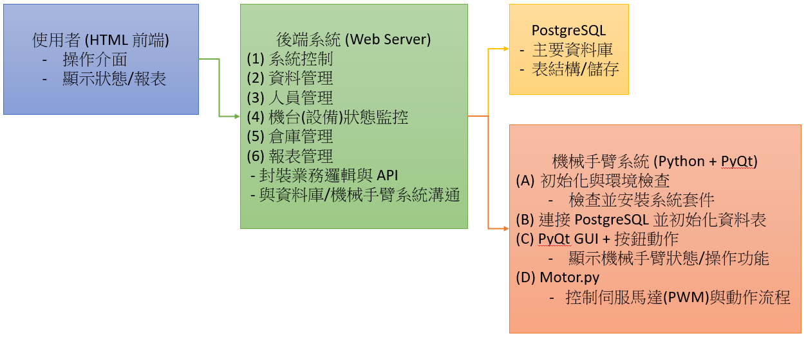

# 機械手臂倉儲系統

## 系統架構

### 1. Client

#### 角色/功能

一般使用者或前端應用程式所在處（可能是瀏覽器、手機App或其他系統）。

經由 HTTPS 與 Nginx 互動，呼叫對外的 API 進行系統操作或查詢資料。

#### 可能操作

登入/登出（驗證及權限）。

執行倉儲管理或機械手臂控制等功能（透過後端 API）。

查詢報表、狀態監控、設備異常警告等。

### 2. Nginx (Reverse Proxy)

#### 角色/功能

作為系統的前線門戶，接收用戶端（Client）經由 HTTPS 所送達的請求。

將流量根據路由規則/位置（如 URI path）反向代理（Reverse Proxy）至對應的內部服務：

Web Server（通常在 8080 port）。

Docker 內的 PostgREST 或其他服務（通常在 3000 port）。

#### 重點

提供 SSL/TLS 加密（HTTPS），確保資料傳輸安全。

可實作負載平衡、快取等進階功能（視需求）。

確保對外暴露的只有 443 等安全連接埠。

### 3. Web Server

#### 角色/功能

執行應用程式邏輯，通常為後端 API 或網頁伺服器（例如 Node.js、Python Flask/Django、或其他框架）。

負責向資料庫或 PostgREST 進行資料讀寫，也可能直接與 Docker 內其他服務互動。

提供前端網頁、靜態檔案，或與 Client 間做業務邏輯的轉換。

#### 範例功能

倉儲系統管理介面（例如貨品維護、庫存檢查）。

使用者與權限控管模組。

報表生成與下載服務。

機台(設備)狀態監控的資料處理與轉發。

### 4. Docker 內服務

#### 4.1 PostgreSQL

##### 角色/功能

系統主資料庫，儲存使用者資訊、庫存資料、機械手臂運作日誌、感測器數據等。

提供可靠的交易 (ACID) 與資料一致性保證。

##### 重點

可透過 Docker-compose 等方式實作快取或備援機制。

搭配資料備份策略（pg_dump / pg_basebackup），確保災難復原能力。

#### 4.2 PostgREST

##### 角色/功能

透過自動化方式，將 PostgreSQL 資料庫轉換為 RESTful API 介面。

前端或其他服務可直接呼叫這些自動生成的 API 進行 CRUD 操作（Create/Read/Update/Delete）。

##### 好處

節省 API 開發時間，減少後端程式撰寫。

可與 PostgreSQL 權限整合，保護敏感資料。

### 5. Arm Robot（機械手臂系統）

#### 5.1 PyQt + PostgreSQL + smbus

##### PyQt (GUI)

提供機械手臂本地端操作的圖形介面，用於手動操作、維修模式或緊急停止等功能。

顯示即時資訊（如馬達參數、錯誤訊息、目前執行的任務）。

##### PostgreSQL（局部或共用）

若機械手臂端需要在當地儲存動作紀錄，或與主系統資料庫同步備份時，可能在此安裝 PostgreSQL。

亦可直接使用 Docker 內的 PostgreSQL，看專案整合規劃。

##### smbus

與硬體溝通（Servo Motor、感測器等）時所使用的通訊匯流排（如 I²C）。

接收動作指令（旋轉角度、移動速度等）或回傳感測器數據（位置、電流、溫度）。

#### 5.2 Servo Motor 控制

##### 角色/功能

機械手臂核心：透過 smbus 傳遞指令給 Servo Motor，驅動機械手臂執行特定動作（抓取、移動、放置）。

執行完成後將狀態或結果（成功/失敗/錯誤碼）回傳至 PyQt 介面或後端系統。

##### 重點

需保證通訊即時性和可靠度，避免錯誤操作造成安全風險。

可以結合感測器資訊（如角度、力度）動態調整動作參數。

### 6. 資料流與通訊流程概略

#### Client → Nginx

使用者透過網頁或 API 客戶端，經由 HTTPS 請求到 Nginx。

Nginx 再根據路由規則分流至 Web Server 或 PostgREST。

#### Nginx → Web Server (Port 8080)

若是系統功能或前端網頁需求，Nginx 將請求反向代理到 Web Server。

Web Server 進行業務邏輯處理，並透過 Docker 內的服務（PostgREST / PostgreSQL）讀寫資料。

#### Nginx → Docker (Port 3000, PostgREST)

若前端直接存取 PostgREST 所自動生成的 API，Nginx 會將路由轉發至 3000 port 的 PostgREST。

PostgREST 依據 DB 權限和 URL 自動進行 CRUD 操作。

#### Web Server / PostgREST → PostgreSQL

Web Server 和 PostgREST 均可讀寫 PostgreSQL 資料庫，用於儲存或查詢系統所需的資料。

#### 後端 API → Arm Robot

針對機械手臂控制或狀態查詢，後端可透過 API（HTTP、WebSocket 或其他協定）向 Arm Robot 發送指令。

機械手臂接收指令後執行伺服馬達動作並回傳結果。

#### Arm Robot (PyQt) → smbus → Servo Motor

機械手臂系統將動作指令轉為 smbus 訊號，驅動 Servo Motor 實際運作。

執行過程中產生的回饋資訊（角度、運行時間、故障警告）可回傳給 PyQt GUI 或上傳至主資料庫。