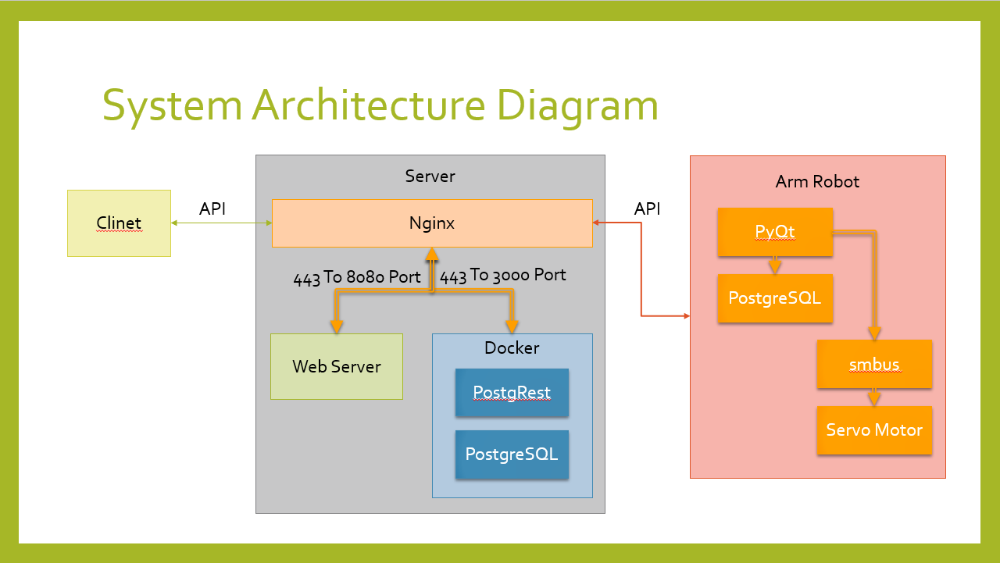

# 機械手臂倉儲系統

## 系統架構

### 一、Web Server

1. 操作介面

提供使用者登入/登出功能，以及角色與權限控管（管理者、操作員等）。
顯示並操作系統功能按鈕（例如：啟動、停止、重置、急停機械手臂）。
提供倉儲管理介面（新增/編輯/刪除貨品資訊、庫存查詢、出入庫操作）。

2. 狀態/報表顯示

即時顯示系統整體運行狀況與機械手臂狀態（正常/待機/故障等）。
呈現倉儲資料與庫存統計（列表、圖表）。
生成並顯示各式報表（庫存報表、異常報表、出入庫報表），可供下載或列印。

### 二、後端系統

1. 系統控制

接收前端指令（啟動、停止、急停等），並透過 API Server 或直接與機械手臂系統溝通。
實作工作流程與排程邏輯（例如：自動化進出庫順序、優先權等）。

2. 倉庫與資料管理

負責管理貨品、貨架位置、料箱資訊，以及出入庫作業的邏輯。
與資料庫(PostgreSQL)串接，進行資料的新增、刪除、查詢、更新。
處理批次匯入/匯出資料、庫存調整、異常庫存標記等功能。

3. 人員管理

使用者註冊、登入/登出處理。
角色與權限設定，控制誰可執行哪些操作（例如只能查詢、或可進行維修等）。
保持人員操作日誌，方便追蹤或稽核。

4. 機台(設備)狀態監控

定期或即時向機械手臂系統取得運作資訊（溫度、電流、動作執行狀況）。
異常情況（例如感測器故障、馬達過熱）時發送告警資訊給前端或系統管理員。
整合感測器數據並紀錄在資料庫，以利後續報表或預防性維修分析。

### 三、PostgreSQL（資料庫）

1. 主要資料庫

儲存系統中所有關鍵資料：使用者資料、貨品/庫存資料、機台狀態紀錄、系統日誌、任務紀錄等。
透過後端系統或機械手臂系統讀寫，確保交易一致性與資料完整。

2. 表結構/儲存

定義各種資料表（例如：users, items, inventory, tasks, device_logs 等）。
建立必要的索引與外鍵關係，優化查詢與維護方便性。
定期備份與災難復原機制，確保資料安全。

### 四、API Server

1. 對外(後端 / 前端)的 API

封裝機械手臂動作指令的請求介面（例如：移動、抓取、重置）。
提供取得機台狀態、故障碼、感測器數據的端點。
控制權限及 Token 驗證，僅授權用戶或後端系統可發出控制指令。

2. 對內(機械手臂系統)的呼叫

接收機械手臂系統主動回傳的執行結果或警報。
轉發給後端系統或儲存至資料庫（例如執行成功、錯誤碼、執行耗時等）。
確保通訊安全與穩定（HTTPS / TLS 或其他安全協定）。

### 五、機械手臂系統（Python + PyQt）

1. 初始化與環境檢查

檢查硬體／作業系統環境以及相依套件，確保機械手臂運作所需的函式庫、驅動都已正確安裝。
如有必要，連線並驗證 PostgreSQL 是否可用，或進行第一次資料表初始化。

2. 連接 PostgreSQL 並初始化資料表

依需求在本系統內部讀取/寫入動作日誌（例如：馬達動作紀錄、錯誤紀錄）。
與後端系統共用同一資料庫（若權限與設計允許），或僅寫入某些動作紀錄表。

3. PyQt GUI + 按鈕動作

提供現場操作與監控介面：顯示機械手臂當前動作流程、感測器值、故障警示。
按鈕點擊執行特定動作（例如：手動校正、維修模式切換、急停）。
可作為備用介面，若後端或 API 出現問題時，仍能進行一定程度的控制或維修操作。

4. Motor.py

控制實體伺服馬達（透過 PWM）、驅動機械手臂的具體動作流程。
依後端或 API 指令執行任務，如「抓取物品 -> 移動到貨架 -> 放置」等。
產生執行紀錄（成功/失敗/錯誤碼），並回傳或紀錄到資料庫及後端系統。

### 總結

1. Web Server：主要為使用者提供操作介面與可視化報表。

2. 後端系統：負責核心邏輯（系統控制、倉庫與資料管理、人員管理、設備監控等）。

3. PostgreSQL：集中儲存及管理系統資料。

4. API Server：作為後端與機械手臂系統之間的溝通橋樑，提供動作指令下達、狀態回傳等服務。

5. 機械手臂系統：透過 Python + PyQt 實作當地操作介面及伺服馬達控制程式，與後端/資料庫互動。